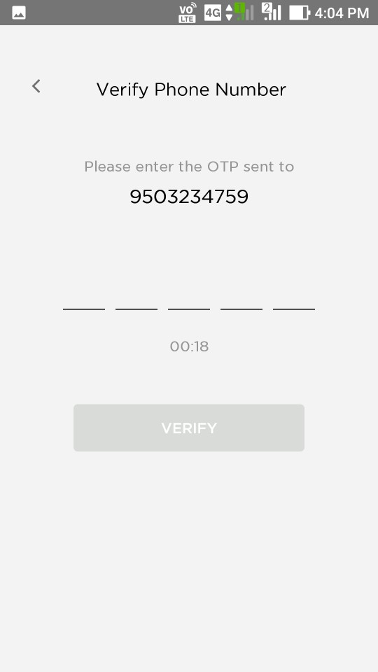

## Full Stack Evliion app to find near by EV charging stations and/or battery swapping stations

## Built with 

1. **Spring Boot**
2. **Spring Security**
3. **JWT**
4. **React and**
5. **Ant Design**

## 1 Register


## 2 Verify OTP screen 1



## 3 Verify OTP screen 2


## 4 Login


## 5 Add vehicle four wheeler


## 6 Add vehicle two wheeler


## 7 Charging station map view


## 8 Charging station map with pop up 1


## 9 Charging station map with pop up 2


## 10 Charging station map with pop up 3


## 11 Start charging page


## 12 Scan QR code


## 13 Charging in progress


## 14 Profile page


## 15 View vehicle details


## 16 Transaction history


## 17 Payment options


## Steps to Setup the Spring Boot Back end app (evliion-app-server)

1. **Clone the application**

	```bash
	git clone https://github.com/amitdan/evliion.git
	cd evliion-app-server
	```

2. **Create MySQL database**

	```bash
	create database evliion_app
	```

3. **Change MySQL username and password as per your MySQL installation**

	+ open `src/main/resources/application.properties` file.

	+ change `spring.datasource.username` and `spring.datasource.password` properties as per your mysql installation

4. **Run the app**

	You can run the spring boot app by typing the following command -

	```bash
	mvn spring-boot:run
	```

	The server will start on port 8080.

	You can also package the application in the form of a `jar` file and then run it like so -

	```bash
	mvn package
	java -jar target/ev-0.0.1-SNAPSHOT.jar
	```
5. **Default Roles**
	
	The spring boot app uses role based authorization powered by spring security. To add the default roles in the database, I have added the following sql queries in `src/main/resources/data.sql` file. Spring boot will automatically execute this script on startup -

	```sql
	INSERT IGNORE INTO roles(name) VALUES('ROLE_USER');
	INSERT IGNORE INTO roles(name) VALUES('ROLE_ADMIN');
	```

	Any new user who signs up to the app is assigned the `ROLE_USER` by default.

## Steps to Setup the React Front end app (evliion-app-client)

First go to the `evliion-app-client` folder -

```bash
cd evliion-app-client
```

Then type the following command to install the dependencies and start the application -

```bash
npm install && npm start
```

The front-end server will start on port `3000`.
